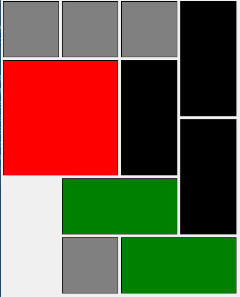

[项目地址:https://github.com/weiyinfu/huarongdao](https://github.com/weiyinfu/huarongdao)

[点我试玩一下](https://weiyinfu.github.io/huarongdao/%E5%8D%8E%E5%AE%B9%E9%81%93html%E7%95%8C%E9%9D%A2.html)

## 华容道背景
赤壁大战后，曹操败走华容道。关羽感念曹操昔日重用之恩，有意放曹操一条生路，
无奈张飞，赵云，马超，黄忠领着四个小兵横刀立马拦住去路，
现在你就是关云长，你要调兵遣将跟这些人周旋，力图放走曹操。

华容道英文名叫：klotski（波兰语klocki，意思是木块）。  
华容道是一种滑块类游戏，由放在方形盘中的10块方片拼成，
目标是在只滑动方块而不从棋盘中拿走的情况下，
将最大的一块（曹操）移到底部出口。

华容道是一个定义简单而操作复杂的游戏。   
跟拼图，推箱子属于一类，都是在二维平面上操作形状达到某种目标。
华容道跟魔方，独立钻石并称为三大不可思议的游戏。   
虽然七巧板、九连环和华容道被称为中国古典智力游戏三绝，可是这却是谬传，因为
流行于中国的华容道是由英国人John Harold Fleming在1932
年所发明，然后本土化加上三国背景，在中国古代文献中并无记载，
极有可能是外国人先发明的。  
华容道到底谁是第一个发明的，目前尚无定论。

## 目录介绍
本仓库包含github上一些开源代码，是从其它
仓库中复制来的，意在学习参考，在此README.md参考资料部分可以看到相关链接。
* html华容道
每个人物都是一张图片，纯html+js+css
* html华容道只有界面没有AI
使用了velocity实现了很流畅的动画效果
* vue华容道
值得深入研究的上等库，作者水平非常高。基于vue，webpack
* vue手机版拼图游戏
3×3的拼图游戏，比较垃圾
* 其余
python文件用于打表，生成全部状态的解法。
huarongdao.json：存储整个状态图，用于分析  
huarongdao.txt：存储每个状态的下一状态，也就是解法  
huarongdao.bin：压缩之后的huarongdao.txt，每一个状态及其着法使用一个int进行表达

## 华容道问题
华容道状态总数是多少？    
有多少个状态是有解的？    
有解的状态是否都互相可达？    
最难的华容道状态是什么？  
华容道最多需要多少步？  

## 编码
### 棋子编码
0 空白
1 曹操
2 横将
3 竖将
4 卒子

### 操作编码
0 左  
1 上  
2 右  
3 下  
4 第二左  
5 第二上  
6 第二右  
7 第二下  

## 状态描述
华容道状态描述有多种方式：
### 方式一：20个0~4之间数字
棋盘是5行4列，所以局面可以用20个（0~4）数字来表示，也就是一个长度为20的字符串。

44431133113302230422表示的局面如下图：



### 方式二：12个0~4之间的数字
棋子一共有10个，两个空白也可以看成是两个棋子，所以一共有12个棋子，这
12个棋子铺满了5行4列的棋盘，从左往右，从上往下依次列出各个棋子即可。  
如方式一中局面可以描述为：444313302042  
转化为二进制：`int("143344430202"[::-1], 5)`，（0，0）处的棋子表示个位，
（0，1）处的棋子表示十位......  

### 方式三：棋子位置表示法，10个0~20之间的数字
10枚棋子，每个棋子的位置为0~20之间的数字，所以相当于10位20进制的数字。  

### 方式四：极致压缩
棋盘全部状态为36万，19bit足以描述。  
但是这种方法实现过于复杂。

## 状态表压缩
打表完成之后，需要尽量缩小表的大小。可以考虑如下几个方案：    
### 文本方式还是二进制方式
文本方式每个字符占用1B，二进制方式描述一个状态能够占用更少的bit数。

### 如何描述一个状态
上文讲述了四种状态描述方案，其中第四种过于复杂，只考虑前三种。
第一种方式文本方式需要20B，第二种状态描述+文本方式需要12B，第三种状态描述+文本方式需要10B
如果采用二进制方式必然比文本方式更省空间。

### 考虑对称性
华容道中只有左右对称，左右对称可以省掉一半的存储。

### 数据组织
* 策略一：键值对方式
状态1 下一状态1  
状态2 下一状态2  

* 策略二：存储着法而非下一状态
着法有8种（上下左右，第一种和第二种）   
状态1 着法  
状态2 着法  
......
在本程序中，使用这种策略，状态使用12个0~4之间的数字法（二进制形式），着法有8中，
这种方法使用1个32位的int即可表示

* 策略三：链式存储
```text
x1->x2
x2->x3
x4-x2
可以简化为
x1->x2->x3
x4->x2
```

* 策略四：先说明映射关系
先给出一个状态列表  
```text
x1
x2
x3
x4
然后
0->2 表示x1->x4
0->1 表示x1->x2
```
基本思想就是使用简短的数字来描述全部状态。

* 策略五：树形表示
```text
x1
    x2
        x3
    x4
    x5
表示
x2->x1
x4->x1
x5->x1
x3->x2
```

每个结点只有一个父节点，这个父节点就表示该节点的下一状态。  
所以存储时，只需要存储整个树形结构即可。这种表示方式每个节点只出现了一次。  
必然优于任何其它策略。

* 策略五：着法+状态列表
```text
上：x1 x2 x3
下：x4 x5
左：x6 x7
......
```
这种方式同样极其节省空间，每个状态只出现了一次。

## 结论
状态总数：363480
可解状态总数 267115
已经是终止局面 24780
去掉对称状态数和已解状态数之后 121285

步数与状态数之间的对应关系如下所示，其中在统计步数时，如果小方块连续移动两格
看作两步，而有些地方将方块连续移动看作一步。
```text
0:24780
1:1357
2:2148
3:3965
4:4926
5:6259
6:6710
7:6012
8:5120
9:3957
10:2865
11:2315
12:1816
13:1583
14:1460
15:1376
16:1236
17:1018
18:870
19:750
20:688
21:672
22:693
23:668
24:708
25:716
26:754
27:782
28:882
29:1014
30:1130
31:1238
32:1384
33:1517
34:1716
35:1889
36:1991
37:2125
38:2226
39:2319
40:2416
41:2588
42:2702
43:2870
44:3108
45:3270
46:3297
47:3273
48:3237
49:3263
50:3225
51:3147
52:3036
53:2970
54:2880
55:2747
56:2722
57:2602
58:2404
59:2260
60:2150
61:2000
62:1955
63:1867
64:1745
65:1691
66:1699
67:1683
68:1715
69:1787
70:1850
71:1804
72:1766
73:1763
74:1842
75:1777
76:1765
77:1818
78:1900
79:1953
80:1936
81:2008
82:2020
83:1946
84:1869
85:1834
86:1798
87:1799
88:1769
89:1748
90:1707
91:1674
92:1635
93:1594
94:1588
95:1626
96:1640
97:1686
98:1628
99:1548
100:1458
101:1396
102:1337
103:1301
104:1214
105:1149
106:1062
107:932
108:832
109:794
110:743
111:702
112:668
113:642
114:620
115:564
116:561
117:558
118:594
119:643
120:702
121:781
122:866
123:882
124:873
125:861
126:834
127:825
128:822
129:739
130:650
131:579
132:564
133:492
134:448
135:416
136:389
137:340
138:308
139:238
140:183
141:149
142:114
143:95
144:88
145:84
146:74
147:54
148:38
149:34
150:34
151:28
152:24
153:28
154:26
155:24
156:20
157:22
158:22
159:24
160:28
161:26
162:14
163:10
164:10
165:16
166:16
167:10
168:12
169:14
170:16
171:18
172:20
173:18
174:24
175:26
176:24
177:18
178:10
179:6
```


最难的六种状态：179步

```text
34443311331132242200
44431133113302230422
44431133113342232200
34443311331132240022
34443311331132202240
44431133113342230022
```

存在无法移动的状态
```text
3223
3033
2234
4114
0114
```
这种状态只能移动左下角的卒子，而无法移动其它棋子。

如果将华容道全部状态看作一个大图，那么这个图里面的分支有很多个，也就
是说可解状态并不是互相可达的。

## 一道题：平面棋盘放特定形状的棋子
给定一个r行c列的空白棋盘，一共有r*c个格子。给定若干个形状各异的棋子，
表示为：
shape1 count1
shape2 count2
shape3 count3
shape4 count4
......
意思是形状为shape1的棋子有count1个
形状为shape2的棋子有count2个
形状相同的棋子把它们看作一种棋子。
问有多少种放置方法？
这个问题可以用过递归的方式解决。
这里的shape不一定是实心的，也可以是空心的形状。

```python
li=[(shape1,count1),(shape2,count2)]
board=[[0]*n for _ in range(m)]
all_states=[]
def put(val,shape):
    把棋盘上shape所覆盖的格子赋值为val
def canput(pos,shape):
    返回在棋盘的pos处能否放下shape
def go(index,count,pos):
    if count==0:#如果当前形状已经放完了
        if index+1==len(li):#如果已经没有更多形状了
            all_states.append(board)
        else:#进行下一形状
            go(index+1,li[index+1].count,0)
        return
    for i in range(pos,board_size):
        if canput(i,li[index].shape):
            put(index+1,li[index].shape)#添加形状
            go(index,count-1,i)#放置下一个，下一个必然不能再当前的左上方位置
            put(0,li[index].shape)#移除形状

```

著名的爱因斯坦难题跟此问题有异曲同工之妙。都是在棋子满足一定约束的条件下求放置方式。

## 爱因斯坦难题
给定以下条件，问：谁养鱼？ 

1。在一条街上，有5座房子，喷了5种颜色。 
2。每个房子里住着不同国籍的人。 
3。每个人喝着不同的饮料，抽不同品牌的香烟，养不同的宠物。 
问题是：谁养鱼？ 

提示： 
1、英国人住红色房子。   
2、瑞典人养狗。   
3、丹麦人喝茶。   
4、绿色房子在白色房子左面。   
5、绿色房子主人喝咖啡。   
6、抽Pall Mall香烟的人养鸟。   
7、黄色房子主人抽Dunhill香烟。   
8、住在中间房子的人喝牛奶。   
9、挪威人住第一间房。   
10、抽Blends香烟的人住在养猫的人隔壁。   
11、养马的人住抽Dunhill香烟的人隔壁。   
12、抽Blue Master的人喝啤酒。   
13、德国人抽Prince香烟。   
14、挪威人住蓝色房子隔壁。   
15、抽Blends香烟的人有一个喝水的邻居。  

## 参考资料
[维基百科-华容道](https://zh.wikipedia.org/wiki/%E8%8F%AF%E5%AE%B9%E9%81%93_(%E9%81%8A%E6%88%B2))
https://github.com/conwnet/huarongdao

https://github.com/ghj1976/HuaRongDao

https://github.com/lmomo/Klotski

https://github.com/Vermisse/practice

https://github.com/MaiJZ-Games/Klotski

https://github.com/winterbang/klotski

https://github.com/asinglestep/hrd